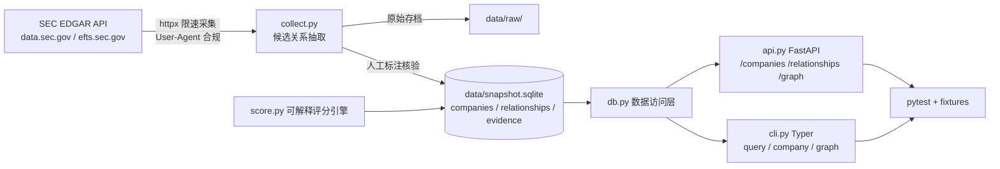

## 用户需求

根据 `ARTi_技术方案.md` 技术方案文档，从零实现一个完整的 ARTi 供应链与合作关系研究挑战项目。

## 产品概述

一个针对 NVIDIA (NVDA) 的供应链与合作关系研究服务。系统从合法公开数据源（以 SEC EDGAR 为主）实际抓取数据，经人工标注核验后形成五类关系数据（supplier / customer / partner / investor_or_investee / peer），每条关系附带可追溯证据链与可解释的 0-100 置信度评分。服务通过 HTTP API 与命令行两种方式对外提供查询能力，内置数据快照保证评审者无需联网即可复现。

## 核心功能

- **数据采集**：调用 SEC EDGAR 官方接口抓取 NVIDIA 及上下游公司（TSMC、SK Hynix、AMD、Broadcom 等）的 10-K/10-Q 披露与全文搜索结果，遵守 robots 与限速规则，原始响应存档到 `data/raw/`，生成 `data/snapshot.sqlite` 快照。
- **五类关系数据模型**：每条关系包含方向（NVIDIA→对方 / 对方→NVIDIA / 双向）、状态（fact / inference / unknown）、研究截点（2026-09-16）、不确定性备注，以及完整证据链（source_url、发布方、发布时间、访问时间、证据定位、访问许可）。
- **可解释评分引擎**：基于证据可信度、信源独立性、时效性、关系类型强度、可量化程度五个因子的确定性加权模型，逐条输出分项明细，纯函数可单测，权重公开声明。
- **HTTP API**：公司画像查询、关系列表（支持公司/类型/最低相关度/截点过滤与分页）、单条关系与证据、关系图数据（nodes/edges）；非法参数返回 422，未知公司返回 404，空结果有明确响应。
- **命令行工具**：`artisearch query / company / graph` 三个子命令，读取本地快照，无需联网。
- **可复现与测试**：仓库自带快照与原始存档，pytest 覆盖关键路径与边界场景（404/422/空证据降级/时效性归零）。
- **文档**：README 覆盖 Q1-Q10 全部验收项，含数据源合法性说明、复现步骤、已知限制盲区、AI 与工具使用声明。

## Tech Stack

- **语言**：Python 3.11+
- **Web 框架**：FastAPI + uvicorn（HTTP JSON API）
- **CLI**：Typer
- **数据模型/校验**：pydantic v2
- **HTTP 客户端**：httpx（SEC EDGAR 请求 + API 测试）
- **存储**：SQLite（标准库 sqlite3，无 ORM，保持轻量可复现）
- **测试**：pytest + httpx TestClient
- **包管理**：requirements.txt + pyproject.toml

## Implementation Approach

全新项目（当前仓库仅有技术方案文档），按方案的目录结构完整搭建。核心策略：

1. **分层架构**：采集层（collect）→ 数据层（db + snapshot.sqlite）→ 业务层（score）→ 接口层（api / cli）。接口层只读快照，与采集层解耦，保证离线可复现。
2. **评分引擎纯函数化**：`score.py` 不依赖任何 IO，输入 Relationship 原始字段，输出总分 + 分项明细。因子规则按方案第 5 节实现（C: SEC 1.0 / 官方 0.8 / 权威媒体 0.6 / 其他 0.4；I: 1 源 0.4，≥3 源 1.0 线性插值；T: ≤1 年 1.0，每年衰减 0.2；R/Q 按关系确定度与量化程度），权重集中在 `config.py` 公开声明，便于单测与复现。
3. **采集层合规设计**：所有请求设置 `User-Agent`（格式 "项目名 联系邮箱"，可由环境变量覆盖，默认提供占位说明而非真实凭据）；全局请求间隔 ≥0.5s；不访问任何需登录/付费墙的资源。原始 JSON 响应按文件名哈希存档到 `data/raw/`，保证抓取可追溯。
4. **快照生成流程**：`scripts/collect.py` 抓取 EDGAR（NVDA CIK 0001045810 的 XBRL company facts、10-K 全文、efts.sec.gov 全文搜索）→ 抽取候选关系与证据段落 → 结合人工标注核验（status、direction、evidence_locator 确认）→ 落库生成 snapshot.sqlite。若执行时网络不可达，如实报告而非伪造数据。
5. **API 校验**：pydantic 查询参数模型（relationship_type 用 Enum，page/page_size 用 Field 约束）天然产出 422；未知 ticker 走显式 404 handler；分页返回 total/items 结构。

## Implementation Notes

- **性能**：数据量小（数十条关系），SQLite 直查即可；`/api/relationships` 分页用 `LIMIT/OFFSET` + `COUNT`，避免全量加载；`/api/graph` 一次性构建 nodes/edges，无性能瓶颈。
- **限速与重试**：采集层用统一的 rate-limited httpx client 封装，退避重试仅针对 5xx/网络错误，429/403 立即停止并报告（合规红线）。
- **快照幂等**：db.py 提供 `init_db` / `upsert_company` / `upsert_relationship`，采集脚本可安全重跑。
- **测试隔离**：API/CLI 测试使用 `tests/fixtures/snapshot.json` 构建的临时 SQLite（tmp_path），不依赖线上数据；评分测试直接构造合成 Relationship，覆盖边界（as_of 早于证据、空证据、单源、多源）。
- **爆炸半径控制**：不引入 ORM/重框架；CLI 与 API 共用同一 db/score 服务层，避免逻辑重复。

## Architecture Design



## Directory Structure

```
arti-challege/
├── README.md                    # [MODIFY] 覆盖 Q1-Q10：研究对象/边界/免责、数据源与合法性、复现步骤、限制盲区、AI 工具使用声明
├── requirements.txt             # [NEW] fastapi、uvicorn、typer、pydantic、httpx、pytest
├── pyproject.toml               # [NEW] 项目元数据、artisearch 包注册、pytest 配置
├── artisearch/
│   ├── __init__.py              # [NEW] 包初始化
│   ├── config.py                # [NEW] 评分权重（公开声明）、as_of 截点、EDGAR User-Agent、限速参数、快照路径
│   ├── models.py                # [NEW] pydantic 模型：Company、Evidence、Relationship、ScoreBreakdown、API 响应/分页模型、查询参数 Enum
│   ├── db.py                    # [NEW] SQLite 初始化、建表、CRUD（get_company/list_relationships/get_relationship/graph）、快照构建工具
│   ├── score.py                 # [NEW] 纯函数评分引擎：五因子计算、分项明细、边界处理（空证据/as_of 早于证据）
│   ├── collect.py               # [NEW] EDGAR 采集客户端：限速 httpx 封装、XBRL facts、10-K 全文、全文搜索、候选关系抽取、raw 存档、落库
│   ├── api.py                   # [NEW] FastAPI 应用：五个端点 + 404/422 处理、 lifespan 初始化
│   └── cli.py                   # [NEW] Typer CLI：query/company/graph 三个子命令，表格输出
├── data/
│   ├── snapshot.sqlite          # [NEW] 评审快照（由采集脚本生成 + 人工标注固化）
│   └── raw/                     # [NEW] 原始抓取存档（JSON 响应按来源归档）
├── scripts/
│   └── collect.py               # [NEW] 采集入口：python scripts/collect.py，可重跑，守 robots/限速
└── tests/
    ├── fixtures/
    │   └── snapshot.json        # [NEW] Golden 数据 fixture（合成关系集，含各 status/type/边界样本）
    ├── test_score.py            # [NEW] 评分引擎单测：各因子、边界、确定性
    ├── test_api.py              # [NEW] API 测试：关键路径 + 404/422/分页/空图
    └── test_db.py               # [NEW] 数据层测试：快照构建、过滤、graph 构建
```

## Key Code Structures

```python
# artisearch/models.py 核心接口
class RelationshipType(str, Enum):
    supplier = "supplier"; customer = "customer"; partner = "partner"
    investor_or_investee = "investor_or_investee"; peer = "peer"

class Evidence(BaseModel):
    source_url: str; publisher: str; published_at: date | None
    accessed_at: date; evidence_locator: str; access_license: str; note: str | None

class ScoreBreakdown(BaseModel):
    credibility: float; independence: float; timeliness: float
    relation_strength: float; quantifiability: float
    weights: dict[str, float]; total: int  # 0-100

class Relationship(BaseModel):
    id: str; subject: str; object: str
    relationship_type: RelationshipType
    direction: Literal["nvidia_to_object", "object_to_nvidia", "mutual"]
    status: Literal["fact", "inference", "unknown"]
    as_of: date; confidence_score: int; score_breakdown: ScoreBreakdown
    evidence: list[Evidence]; uncertainty_notes: str | None

# artisearch/score.py 签名（纯函数）
def score_relationship(relationship_input: RelationshipInput, as_of: date) -> Relationship: ...
```